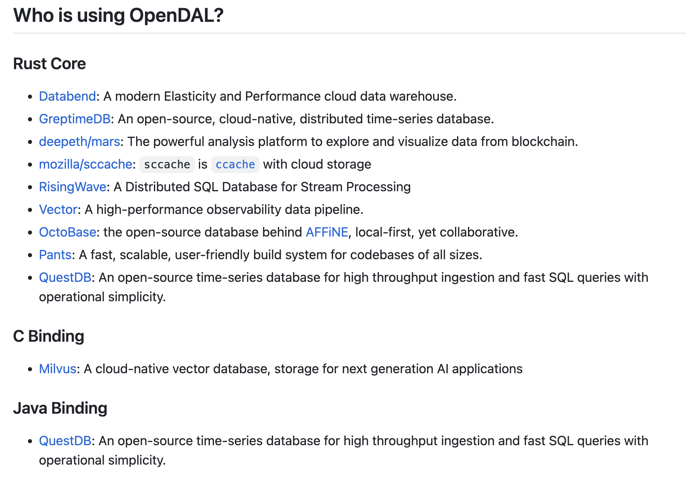
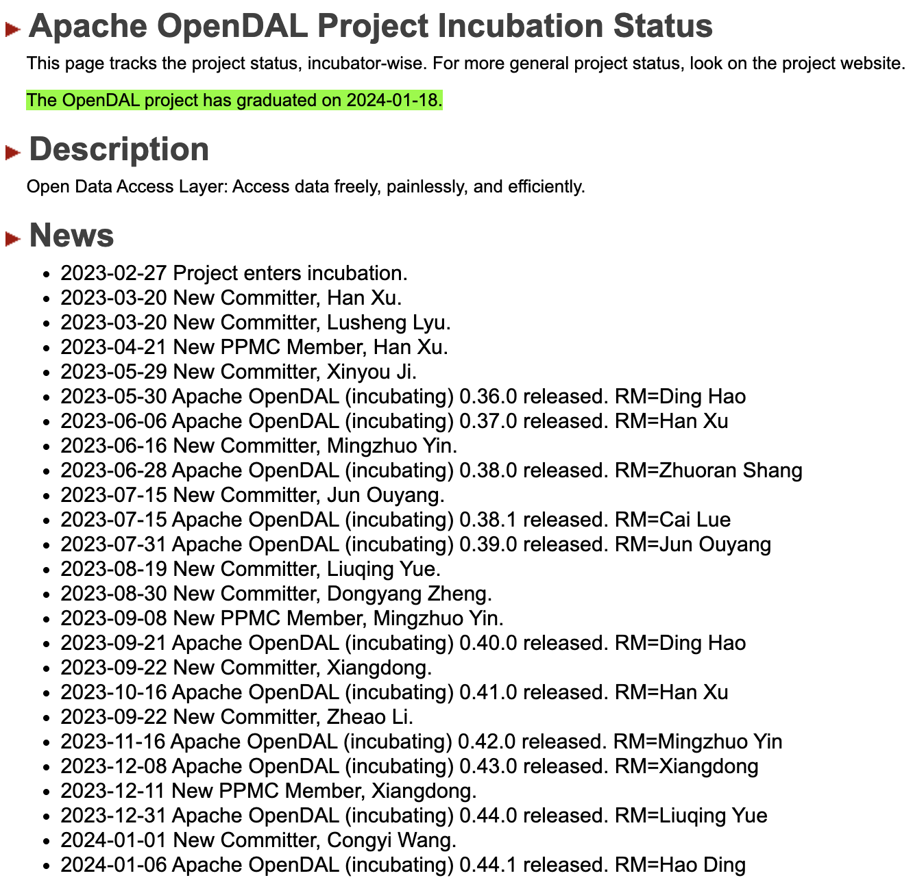
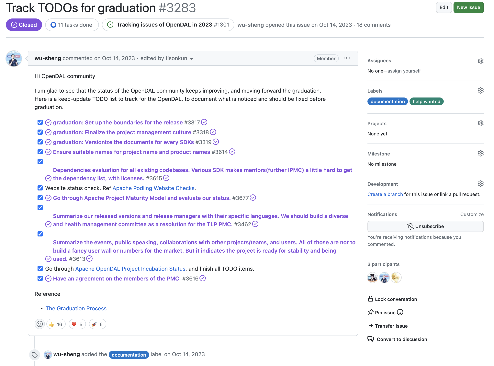
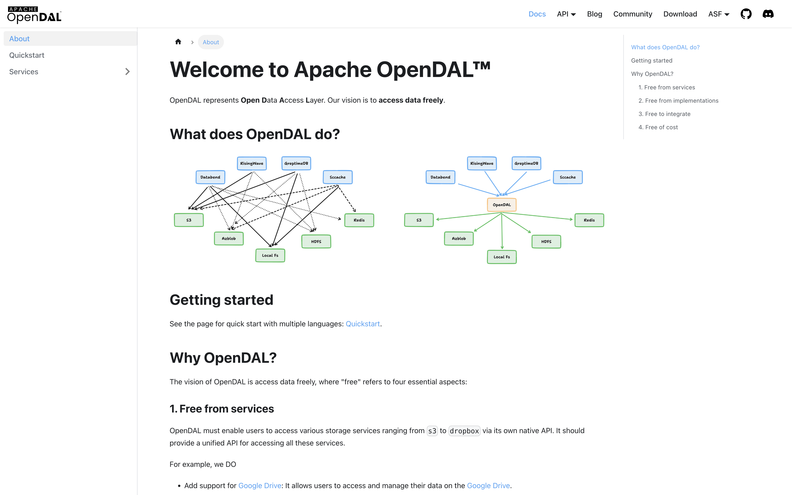
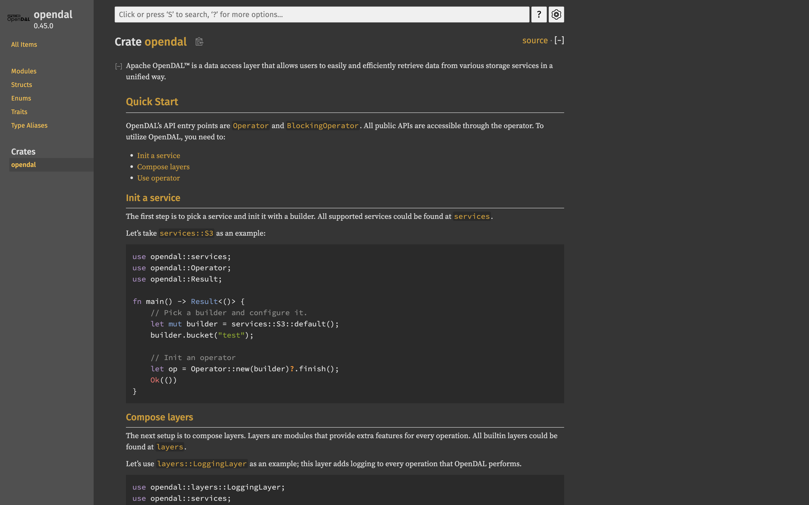

## What is Apache OpenDAL?

Apache OpenDAL is a data access layer provided in the form of a software library. It allows users to access data stored on various storage services simply and efficiently through a unified API. You can consider it as an improved implementation of an S3 SDK, or use the unified OpenDAL API to simplify the work of configuring and accessing different data storage services (such as S3, HDFS, GCS, Aliyun OSS, etc.).

OpenDAL is provided as a library, so there is no need to deploy additional services when using OpenDAL. The core of OpenDAL is written in Rust. During the project's incubation and growth, the community has also developed bindings for languages such as Java, Python, Node.js, and C, to support the convenient integration of OpenDAL capabilities into programs written in these languages.

The following diagram lists the users of Apache OpenDAL's multi-language implementations:



You can use the unified APIs of OpenDAL as follows:

```rust
async fn do_business() -> Result<()> {
    let mut builder = services::S3::default();
    builder.bucket("test");

    let op = Operator::new(builder)?
        .layer(LoggingLayer::default())
        .finish();

    // Write Data
    op.write("hello.txt", "Hello, World!").await?;
    // Read Data
    let bytes = op.read("hello.txt").await?;
    // Fetch Metadata
    let meta = op.stat("hello.txt").await?;
    // Delete Data
    op.delete("hello.txt").await?;

    Ok(())
}
```

As you can see, the API for data reading and writing is carefully designed. Users wanting to access data stored on different services only need to modify the configuration of the Operator, without having to change any code for the actual read and write operations.

## The History of Apache OpenDAL

OpenDAL was initially created by [@Xuanwo](https://xuanwo.io/about/) at DatafuseLabs as a data access layer for the [Databend](https://databend.rs/) project. Prior to OpenDAL, Xuanwo had developed a similar software called BeyondStorage while at QingCloud. Unfortunately, [BeyondStorage eventually halted its development](https://xuanwo.io/en-us/2023/01-beyond-storage-why-we-failed/) for various reasons.

In contrast to the setbacks encountered by BeyondStorage, OpenDAL quickly flourished with a clear goal in mind:

- In December 2021, Xuanwo began developing the data access layer, which later became the core of OpenDAL, within the Databend codebase.
- In the same month, Xuanwo started drafting the positioning and goals of OpenDAL.
- On February 14, 2022, Valentine's Day, the code of OpenDAL was extracted from the Databend codebase and began operating as an independent open-source project.

In August 2022, Xuanwo reached out to me to explore the potential of OpenDAL joining the ASF Incubator.

At that time, the project had been in development for only about six months, predominantly crafted by Xuanwo himself, and had not yet been adopted outside Databend. I shared with Xuanwo [the podling proposal template](https://cwiki.apache.org/confluence/display/INCUBATOR/New+Podling+Proposal), provided guidance for project development, and advised focusing on user growth, active integration with other well-known software, creating demonstrative samples, and engaging developers through collaborative development opportunities.

In January 2023, just before the Chinese New Year, I discussed with members of [Apache Kvrocks](https://kvrocks.apache.org/) about starting preparations for graduation. Recalling previous conversations with Xuanwo about OpenDAL's intention to enter the Incubator, I pulled Xuanwo into drafting the incubation proposal, and we initiated the [proposal discussion](https://lists.apache.org/thread/px7wjcjy3rd4s59d4d3ll1x6y11d240r) in early February.

Thanks to the project's clear positioning and its potential to replace the fading [Apache jclouds](https://jclouds.apache.org/) project, the incubation proposal was ["unanimously passed"](https://lists.apache.org/thread/h76wsb582xjdph6p430vjq3oq26502bc).

:::info

The experiences during this period are further detailed in the following blog posts:

* [Way to Go: OpenDAL successfully entered the Apache Incubator](https://opendal.apache.org/blog/opendal-entered-apache-incubator/)
* [2023-07 Milestones (In Chinese)](https://xuanwo.io/reports/2023-07/)

:::

During 2023, the Apache OpenDAL community succeeded in rapid development, achieving commendable results in various aspects such as feature development, version releases, and community growth:



The picture above illustrates that during the incubation, OpenDAL welcomed 10 new Committers and 3 new PPMC members, with 8 different Release Managers publishing 11 releases that conformed to Apache standards.

Beyond what the picture shows, OpenDAL initiated and implemented 23 technical proposals, addressed over 1000 issue reports, and merged over 2000 patches during incubation.

As early as August 2023, I believed that OpenDAL was nearing graduation. In October 2023, after some discussions, one of the project mentors, Sheng Wu, created a [checklist](https://github.com/apache/opendal/issues/3283) of tasks that needed to be completed before graduation, officially initiating the graduation process.



The tasks on this checklist were not all straightforward to understand for the OpenDAL PPMC, and many were quite challenging. As we delve into the challenges faced by OpenDAL in its graduation process later, you will see that some challenges were difficult to overcome. Thus, after completing some more understandable tasks, the list saw no progress at a standstill of four to five weeks.

By the end of November 2023, while preparing to initiate two new incubation proposals, I decided to push forward with OpenDAL's graduation efforts to avoid the situation where tasks that are theoretically able to be done at once become dragged out, and we have to restart it completely in the future.

In hindsight, through discussions with Xuanwo, I learned that developers generally felt unfamiliar with those tasks. Faced with many tasks that seemed daunting at first glance, their initial reaction was to put them off subconsciously. As a project mentor, I explained these tasks, which were tinged with bureaucracy, in plain language to the PPMC members and broke them down into practical, executable tasks, moving the project toward graduation.

In December 2023, the OpenDAL project community internally [reached a consensus on graduation](https://lists.apache.org/thread/kq00ynqtbbwsh2n7485s5vypzjropck6). Subsequently, the graduation proposal was submitted for discussion to the ASF Incubator mailing list. After a month of discussion and continuous resolving issues, in January 2024, the project successfully [passed the graduation vote](https://lists.apache.org/thread/nxd3218gdnylp8g2w7jhcjktorthjydl) and was approved by the Board of Directors during the Board Meeting: **Apache OpenDAL officially became a top-level project of the ASF**.

## The Criteria of PMC Members

Under the ASF terminology, a PMC Member refers to a Project Management Committee member, roughly equivalent to a maintainer of an open-source project. All PMC Members are committers and can cast binding votes on project management issues.

During the incubation, a project also has a Project Management Committee, known as the Podling Project Management Committee (PPMC), with "Podling" indicating a project in incubation. The initial PPMC usually consists of the Initial Committers mentioned in the incubation proposal. This is followed by the nomination and voting process to invite new PPMC members.

At the time of graduation, the graduation proposal must specify who will compose the PMC of the new top-level project. Typically, it includes PPMC members and project mentors. Moreover, committers invited during the incubation stage are potential candidates for membership.

:::note

There are always exceptions. For example, when Apache Doris graduated, some original PPMC members joined the StarRocks company (formerly "DorisDB," which violates the ASF Trademark Policy) and continued to damage the Doris brand during its incubation. These members were not included in the PMC at graduation and were no longer committers to the top-level project.

:::

I tend to give more privileges to community members for acknowledging their contributions, to reduce the barriers to their participation. Therefore, when initiating discussions on OpenDAL PMC members, I proposed an extremely permissive proposal to include all PPMC members and committers in the PMC.

* [Have an agreement on the members of the PMC](https://lists.apache.org/thread/rzg7yb14cy2y3dw5twt7olgvy3whc814)

Xuanwo and other PPMC members challenged this proposal. They believed that including committers in the PMC because of the graduation milestone was not feasible.

Sheng Wu explained that the ASF culture advocates actively bringing in committers and maintainers. Committers and PMC members have the same write permissions, but PMC members have additional responsibilities for project management, such as handling security issues, responding to the Board's inquiries and demands, participating in releases and voting, and so on.

In subsequent discussions, OpenDAL PPMC members tended to differentiate between PMC Members and committers, even leading to a hierarchical discourse. However, this is more a matter of expression and context.

:::note

In the context of open-source propagation and advocacy in China, there is often a mindset of "promoting members", or "exchanging privileges for further engagement". Some even say that participating in open-source is like playing a game and leveling up.

It is normal to have different flavors of understanding about how open-source works, but the mindset above is indeed not the approach ASF advocates.

:::

Ultimately, OpenDAL adopted the approach of including members of the PPMC and project mentors and [asking all committers if they wished to participate in project management](https://lists.apache.org/thread/fzq7yzx4ty7f3vn3r8skby107vlzoy0h) as PMC Members. If a committer does not check the mailing list and respond to this email, they are clearly not interested in participating in project management affairs. Eventually, two committers responded to the email, and they have been actively involved in the project's development discussions and driving version releases recently.

Additionally, in the two months until the graduation process was completed, OpenDAL nominated one PPMC member following the usual process and criteria. Ultimately, Apache OpenDAL graduated as a top-level project with 14 PMC members: 4 initial members, 3 nominated during incubation, 2 added through polling, and 5 mentors.

## The Official Website and Documents

<figure>

<figcaption>https://opendal.apache.org/</figcaption>
</figure>

OpenDAL's official website is not quite impressive.

This is partly because the core developers largely lack front-end development skills, and partly because, as a library intended for integration into applications, OpenDAL does not require separate service deployment. Consequently, it doesn't need a dedicated service management page for display. In most cases, OpenDAL is utilized within applications through API calls.

The homepage showcases OpenDAL's three main extension points:

1. OpenDAL's core is a Rust library, but it offers bindings for multiple languages, allowing it to be called from programs written in those languages. Providing new language bindings is an extension point.
2. At its core, OpenDAL's value lies in abstracting away the differences between storage services, enabling users to access data at different locations using a unified API. Adding new storage backend integrations is an extension point.
3. OpenDAL has designed a `Layer` abstraction to provide enhancements on different aspects of the unified API access chain, including retries, logging, monitoring, timeouts, etc.



The documentation navigation displays all the content at once: OpenDAL's design philosophy and how to configure the officially released libraries. "Services" are more of a reference manual for the supported storage backends.

Conversely, the documentation on how to get involved in OpenDAL development and handle project management tasks as a committer or PMC member is relatively complete due to the frequent actual need.

Other pages, like the blog, which has only posted five articles, and the API page, which mainly serves as a reference manual for languages other than Rust, have less impact. The "Downloads" and ASF-related pages primarily exist to meet ASF requirements and offer little value to the project itself.

Sheng Wu mentioned the documentation issue in the graduation checklist, focusing on documentation versioning and avoiding exposing temporary documents of unreleased libraries. He suggested that OpenDAL follow the documentation practices of [Apache SkyWalking's multilingual and multimodule documentation](https://skywalking.apache.org/docs/).

One of the OpenDAL PMC members, @suyanhanx, initially completed the [research on documentation versioning](https://github.com/apache/opendal/issues/3319). Still, it was not fully implemented, and the development and release documents were not updated to include the relevant operations.

I believe there is significant room for improvement in OpenDAL's documentation. However, during the graduation check, I used the following standards:

* The official website should be roughly functional, with valid reference links when discussing related concepts.
* At the very least, it should provide enough information for people who want to use OpenDAL, with a clear reading journey for the entire content.
* As for versioning, since OpenDAL has yet to reach version 1.0, it can temporarily provide only documentation for the nightly version, which reflects how users currently use OpenDAL.

[Detailed versioned documentation](https://docs.rs/opendal/) regarding the core design of OpenDAL and the usage of various service backends is already provided:



Going forward, in addition to completing the versioned releases for all languages, OpenDAL's documentation should focus on clarifying concept definitions, common design and usage patterns, and the translation idioms between different languages. Under this premise, directing the actual documentation content to the living documentation alongside code in the Rust core implementation could leverage the comprehensive documentation available in the Rust API docs.

The ideal reading journey for users starts by referring to the documentation on design and usage patterns to determine which specific module's documentation they need to look for in the Rust API documentation. After understanding the corresponding interface contracts, they can then refer to the translation idioms of the interfaces in their preferred programming language to complete the development.

If this level of documentation can be achieved, from a software product perspective, OpenDAL can be considered "competitive".

## Develop and Distribute of Multilingual Bindings

As mentioned earlier, one of the key features of OpenDAL is its multilingual bindings on top of its Rust core library. This allows programs written in various languages to leverage the capabilities of OpenDAL. This is also why OpenDAL can serve as a replacement for the jclouds library, which is written in Java.

Currently, the officially released bindings for OpenDAL in four languages are as follows:

* [Rust Core](https://crates.io/crates/opendal): Native Rust library
* [Java Binding](https://github.com/apache/opendal/blob/main/bindings/java/README.md): Bindings created using [jni-rs](https://github.com/jni-rs/jni-rs) and JNI technology
* [Python Binding](https://pypi.org/project/opendal/): Bindings created using [PyO3](https://github.com/PyO3/pyo3) technology
* [Node.js Binding](https://www.npmjs.com/package/opendal): Bindings created using napi-rs and NAPI technology

Other language bindings currently under development include:

* [C](https://github.com/apache/opendal/blob/main/bindings/c/README.md)
* [C++](https://github.com/apache/opendal/blob/main/bindings/cpp/README.md)
* [.NET](https://github.com/apache/opendal/blob/main/bindings/dotnet/README.md)
* [Golang](https://github.com/apache/opendal/blob/main/bindings/golang/README.md)
* [Haskell](https://github.com/apache/opendal/blob/main/bindings/haskell/README.md)
* [Lua](https://github.com/apache/opendal/blob/main/bindings/lua/README.md)
* [OCaml](https://github.com/apache/opendal/blob/main/bindings/ocaml/README.md)
* [PHP](https://github.com/apache/opendal/blob/main/bindings/php/README.md)
* [Ruby](https://github.com/apache/opendal/blob/main/bindings/ruby/README.md)
* [Swift](https://github.com/apache/opendal/blob/main/bindings/swift/README.md)
* [Zig](https://github.com/apache/opendal/blob/main/bindings/zig/README.md)

Among these, the C Binding has already been used in production environments, while the bindings for other languages are either not yet released or only have a placeholder implementation.

During the development of multilingual bindings, OpenDAL has summarized best practices to develop a binding:

1. Develop a "Hello World" example roughly.
2. Refactor to establish basic engineering, compilation, and testing structures.
3. Refactor to design basic API mappings.
4. Ensure the corresponding release process for each language.

The most challenging part is engineering and distributing to target platforms. Currently, the design and development of the C Binding are well-established. However, due to the lack of a standardized distribution process in the C ecosystem, the official release of the C Binding has been delayed.

In contrast, languages like Rust, Python, and Node.js, which are officially endorsed distribution platforms, allow OpenDAL to easily create corresponding GitHub Actions workflows for automated releases.

It is worth mentioning that although most Java libraries are published on Maven Central, the repository used by ASF projects is not the commonly used Sonatype repository but ASF's repository. This is unsurprising, considering that [Apache Maven](https://maven.apache.org/) is also an ASF project.

However, this means that supporting the automatic release of OpenDAL Java Binding requires involvement from ASF INFRA. OpenDAL Java Binding is the second Java library supported by ASF for automated releases and the first Java library to automate the release of JNI native shared libraries. The related work includes:

* [Setup opendal-java project GitHub secrets for signing artifacts](https://issues.apache.org/jira/browse/INFRA-24880)
* [ci: automatic java binding release](https://github.com/apache/opendal/pull/2557)
* [docs: auto release maven artifacts](https://github.com/apache/opendal/pull/2729)
* [docs(release): describe how to close the Nexus staging repo](https://github.com/apache/opendal/pull/3125)

In addition, the OpenDAL PMC actively collaborates with ASF trademark officers to explore the possibility of distributing the OpenDAL NPM package with the [@theasf](https://www.npmjs.com/~theasf) account:

* [Add Apache org account as the OpenDAL NPM package owner](https://issues.apache.org/jira/browse/INFRA-25325)

Jarek Potiuk from Apache Airflow is working with the PyPI team to create an ASF account. The OpenDAL PMC watches the progress and is ready to integrate the OpenDAL Python Binding into this account:

* [Provide a trusted PyPI publisher capability for Python projects via INFRA](https://issues.apache.org/jira/browse/INFRA-24678)

It is evident that OpenDAL takes software distribution seriously and, through the mechanisms provided by the platforms and close collaboration with ASF INFRA, effectively enhances the reliability of the software packages released.

Finally, ASF places great importance on the software's dependencies' compliance with the software license policies outlined as [ASF 3RD PARTY LICENSE POLICY](https://www.apache.org/legal/resolved.html). OpenDAL provides a `DEPENDENCIES` file for each released artifact to disclose this information. Additionally, since most of the language bindings for OpenDAL are wrapping layers of the Rust core library, the developers strive to minimize unnecessary third-party dependencies to reduce compliance burdens for downstream users.

From a technical perspective, due to the need to integrate with multiple storage service backends and the vision of providing bindings in different languages, OpenDAL places a strong emphasis on engineering.

By checking [OpenDAL's GitHub Actions workflows](https://github.com/apache/opendal/tree/main/.github/workflows/), one can discover that OpenDAL has developed a reusable testing framework. Any new language binding or storage service backend can quickly have the existing test coverage.

Regarding language binding technologies, Rust's support for C FFI makes implementing C Binding smooth. Most languages also provide integration methods to access C APIs, allowing the creation of bindings for other languages. This approach is also taken for various bindings in OpenDAL, such as Haskell, Lua, and Zig.

In addition to these solutions that heavily utilize existing technologies, the technologies above, such as jni-rs and napi-rs, encapsulate a layer of interfaces that conform to Rust conventions on top of the existing C API integration methods. This allows the development process only to involve the Rust language and the target language of the bindings. PyO3 goes even further by developing a scaffolding for this development process, simplifying the packaging and configuration integration work. It can be said that this is the Rust ecosystem actively approaching the target language of the bindings. At the low-level technical level, communication still relies on the C ABI on both sides.

I believe OpenDAL will be active on the forefront of deep integration between Rust and other languages. If someone in the ecosystem wants to improve the interoperability experience between Rust and a specific target language, it is worth trying out your ideas on OpenDAL.

## Policies, Bureaucracy, and Foundation Development

As previously mentioned, after reaching a consensus on graduation on the dev mailing list, the discussion was proposed on the incubator's mailing list and underwent a month of intense deliberation. OpenDAL PPMC continued addressing the project's existing issues before successfully graduating.

The checklist included most of the pre-graduation issues. While addressing the checklist, we spent a lot of time researching and discussing issues related to document versioning, dependency compliance, and PMC membership. The rest of the tasks were completed in an orderly and successful manner.

However, an important issue that was overlooked in the checklist was the PMC's adherence to the ASF's brand policy to protect both the project and ASF's brands. A fundamental aspect of this is the project's official naming convention of "Apache Foo."

The donation of OpenDAL did not involve a name change, so most materials and core project members continued to refer to the project as "OpenDAL" after the donation, believing that the fact of the project's affiliation with ASF would be increasingly reinforced over time and thus did not pay special attention to it.

In reality, the primary violations of the brand policy within ASF mainly involve actions like DorisDB's direct use of the brand to promote competing products or referring to one's product as the commercial version of an ASF project in a business context. OpenDAL, while originating from DatafuseLabs, has little to no relation to commercialization. Its core developers are primarily individuals, so I believe it should be fine as long as no harm has been done to ASF's brand.

However, IPMC Chair Justin Mclean did not see it this way. He raised concerns about branding issues during the [discussion of OpenDAL's graduation proposal](https://lists.apache.org/thread/3lwt4zkm1ovoskrz77y69pwntvn27xvs).

Looking back, Justin's initial statement was, "I found a few minor issues where some name and branding work needs to be done," which does not sound very strong. But after Xuanwo's first response failed to meet Justin's expectations of perfect adherence to ASF policies, he suggested that the PMC should "have a good read of our branding policy".

Subsequently, when PMC members were unsure about what Justin was referring to, project mentor Sheng Wu expressed a different opinion, similar to what I mentioned above, that the OpenDAL project members had no intention of harming ASF's brand. The pointed-out issues were not significant and thus not graduation blockers.

This response frustrated Justin, leading him to believe that the PMC disregarded policies and was seriously unwilling to comply. As a result, he voted against the graduation proposal with a -1.

This process gave the OpenDAL project members an unpleasant experience. It's not that a -1 vote couldn't be cast, but after subjectively determining that the OpenDAL PMC was uncooperative and unwilling to solve problems, the continuous challenges were not aimed at solving specific issues but at proving that the OpenDAL project members were bad actors. Even after the OpenDAL PMC members had read through the brand policy and made some improvements, they did not receive recognition or further suggestions for improvement but continuous -1 criticism of "you are not doing well enough".

As a consequence, [the OpenDAL graduation proposal did not pass with a unanimous vote](https://lists.apache.org/thread/nxd3218gdnylp8g2w7jhcjktorthjydl).

:::note

This whole story is evidence that "Open Communications" in [The Apache Way](https://www.apache.org/theapacheway/) works well. We can check these public records and read them objectively.

:::

OpenDAL PMC kept working on understanding the policies and improving its compliance. I started a few discussions on the trademarks channel. In the end, we discovered that many top-level projects did not strictly adhere to the brand policy. Even some content released through official channels at the ASF foundation level, which should be reviewed according to the brand policy, may have imperfections.

However, this is not a reason for ASF project members to slack off. On the contrary, it reveals their vulnerability in terms of brand protection. The purpose of these discussions is not to argue right or wrong but to review the status quo of how the ASF brand policy is applied to ASF projects so that we can evaluate whether the OpenDAL PMC actively dealt with brand policy issues.

:::note

In the ASF Incubator, top-level projects are generally not considered as references. From a practical point of view, this is because many top-level projects are not fully compliant, so using them as a reference can be improper.

However, I still insist that we should take top-level projects as examples in the discussion on the incubator's mailing list, at least for spreading and recognizing things they are doing well. For things that they are not doing well, we could speak it out and reach the related officers beyond the Incubator to coordinate and resolve them.

This is because I'm aware that most open-source projects entering the Incubator are influenced by other top-level projects, and the object of incubation is to graduate and become a top-level project. If top-level projects are slacking off and not following the ASF policies, how can podlings understand the policy requirements they are expected to comply with?

:::

During the discussions, we identified various brand issues with OpenDAL and other top-level projects, and all known issues were actively resolved. These efforts were summarized and sent to the graduation proposal result discussion thread mentioned above.

I believe the following points are worth noting.

**The first one is about the way issues are addressed within the Incubator.**

As an open-source community, the best way to address issues is by submitting patches to fix them and conveying your ideas in the process. At the very least, providing a reproducible bug report is better than simply saying, "I think you have a problem; you should find and fix it yourself."

I used an analogy that if someone who has never been involved in project development or actually used the project comes along and says, "I feel like your code has some performance issues, you'd better test it yourself and make changes", this kind of vague report won't get the attention of the project maintainers.

This can be expressed as the following two comparisons:

* Helping us rather than failing us;
* Correcting with contributions rather than instructions.

**The second one is about the issue of policy documentation and implementation.**

ASF excels in having corresponding documentation for its community rules and practices:

- [The official website](https://apache.org/foundation/how-it-works/) records the foundation's goals, main definitions, responsibilities of various roles, and related policies such as release, branding, and voting.
- [The community development website](https://community.apache.org/) serves as a reference for best practices in policy application.
- [The Incubator website](https://incubator.apache.org/) includes guidelines for the entire incubation process.
- [The INFRA website](https://infra.apache.org/) explains the location and usage of the foundation's infrastructure.

However, the content on these websites is somewhat outdated and needs more maintenance.

The content on the foundation's official website is scattered and unless one is an experienced long-time member, it is difficult to quickly find the relevant materials.

The best practices on the community development website are mostly from over a decade ago. Despite claiming to be the most widely used maturity model in the open-source world, it does not mention a single word about the branding issues that were challenged in the graduation discussion.

:::info

Rich Bowen, one of the ASF board of Directors, started establishing a working group to address issues around the community development website. For more details, check out [this thread](https://lists.apache.org/thread/wj1prnm95cy0rlvjqgcq15rt2r28wyqg).

:::

Some of the "guidelines" on the Incubator website are not quite practical. Although they were discussed during the updates, most of the reviewers have not been involved in Incubators for quite some time, making it difficult to have a concrete understanding of the issues that arise when implementing the guidelines.

The content on the INFRA website is also fragmented, and unless one is an experienced long-time member, it is difficult to quickly find the relevant materials. Moreover, in the past two decades, ASF has primarily released Java libraries on Maven Central and source code archives on SVN repositories, resulting in a significant gap in the release practices for different languages and software in the modern era.

On the one hand, Apache OpenDAL has encountered challenges with branding and trademarks. On the other hand, due to its multi-language and multi-platform ambitions for automated releases, it challenges the comfort zone of ASF INFRA, that they are working primarily with Java software distribution and source releases for years. Therefore, compared to other projects, OpenDAL has had more interactions with various ASF officers during its development.

This is a good thing. After all, only with the addition of fresh blood can the foundation continue to progress. As long as the challenges are properly guided and resolved through collaboration, encountering problems is not terrible.

**The third one is about the development of the foundation itself.**

From another perspective, why does Justin vote -1 frequently within the Incubator? In fact, this also reflects the issue of talent development within the Incubator. Because too many people don't care about ASF policies and what form The Apache Way should take to build a community and release open-source software, these policy violations and cultural conflicts keep pressing on Justin to handle.

Over time, instead of trying to understand the history of project community development, who did what, and why, the inherent laziness of human nature drives those with strict requirements to immediately give a -1 and say, "Reflect on yourself."

Personally, I have enough motivation to handle compliance and cultural issues. I believe that cooperation and resolving issues through discussion would be sufficient. However, for certain projects, it is true that if you don't vote -1, they won't pay attention to you. There have been such cases.

At a higher level, the issue is that ASF's community development still follows a somewhat "workshop-style" approach. ASF originated from a group of developers who were in the same camp. They came together to form the Apache Group and continued the model of "a small group of people with a series of tribal knowledge running an open-source community."

:::note{title=Quote}

The ASF is well past the point where a small number of folks who have huge "tribal knowledge" can guide the number of projects and podlings that we now have.

:::

While discussing these issues, I have been pushing for and actively fixing a series of missing documentation, promoting the generation and consolidation of best practices, and considering how we can spread these policies, principles, and culture to more people, enabling them to take on the responsibility of propagating and disseminating them proactively. I believe that after 25 years, ASF should consider and improve upon these issues in the face of new open-source community situations and software development methods. In fact, this is also a path for people who engage with ASF projects and learn The Apache Way to grow into foundation members.

## References

Apache OpenDAL writes an official blog about its graduation. Check it out: https://opendal.apache.org/blog/apache-opendal-graduated.
