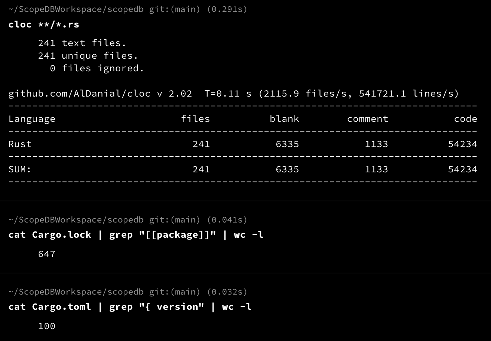
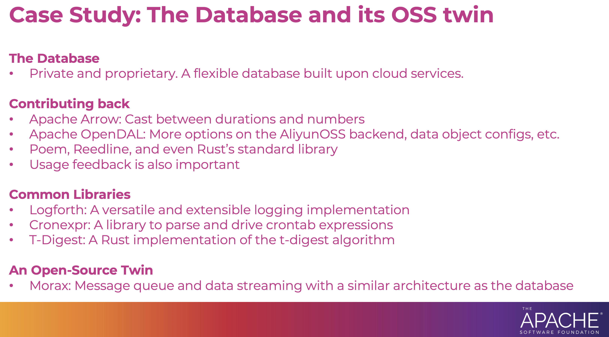

## The Database and its Open-Source Dependencies

Building a database from scratch is often considered daunting. However, the Rust programming language and its open-source community have made it easier.

With a team of three experienced developers, we have implemented ScopeDB from scratch to production in four months, with the help of Rust and its open-source ecosystem.

ScopeDB is a shared-disk architecture database in the cloud that manages observability data in petabytes. A simple calculation shows that we implemented such a database with about 50,000 lines of Rust code, with 100 direct dependencies and 647 dependencies in total.



Here are several open-source projects that we have heavily used to build ScopeDB:

* ScopeDB stores user data in object storage services. We leverage [Apache OpenDAL](https://github.com/apache/opendal) as a unified interface to access various object storage services at users' choice.
* ScopeDB manages metadata with relational database services. We leverage [SQLx](https://github.com/launchbadge/sqlx) and [SeaQuery](https://github.com/SeaQL/sea-query) to interact efficiently and ergonomically with relational databases.
* ScopeDB supports multiple [data types](https://www.scopedb.io/reference/datatypes-overview). We leverage [Jiff](https://github.com/BurntSushi/jiff) with its `Timestamp` and `SignedDuration` types for in-memory calculations, and [ordered-float](https://github.com/reem/rust-ordered-float) to extend the floating point numbers with total ordering.

UPDATE: Filtered internal crates, the open-source dependencies are 623 in total. Check out this [Gist](https://gist.github.com/tisonkun/06550d2dcd9cf6551887ee6305e92edc) to see if your project is one of them \:D (Note that a dependency in the lockfile may not be used in the final binary)

Besides, during the development of ScopeDB, we spawned a few common libraries and made them open-source. We have developed a message queue demo system as its open-source twin.

In the following sections, I will discuss how we got involved and contributed to the upstreams and describe the open-source projects we developed.

:::info{title="Try it Out!"}

You can start a ScopeDB playground with the following command:

```shell
git clone https://github.com/scopedb/community.git
docker compose -f ./community/playground/docker-compose.yml up -d
```

Then, you can connect the playground with the command-line tool:

```shell
docker run -it --rm --entrypoint /bin/scopeql --network host scopedb/scopedb
```

Now, please read the [reference](https://www.scopedb.io/reference/functions-aggregate) and try it out!

:::

## Involve and Contribute Back to the Upstreams

Generally speaking, when you start to use an open-source project in your software, you will always encounter bugs, missing features, or performance issues. This is the most direct motivation to contribute back to the upstreams.

For example, during the migration from pull-based metric reporting to push-based metric reporting in ScopeDB, we implemented a new layer for OpenDAL to support report metrics via opentelemetry:

* [feat(layer/otelmetrics): add OtelMetricsLayer](https://github.com/apache/opendal/pull/5524)

When onboarding our customers to ScopeDB, we developed a tool to benchmark object storage services with OpenDAL's APIs. We contributed the tool back to the OpenDAL project:

* [feat(bin/oli): implement oli bench](https://github.com/apache/opendal/pull/5443)

To integrate with the data types provided by Jiff and ordered-float, we often need to extend those types. We try our best to contribute those extensions back to the upstreams:

* [feat: optionally integrate with num-cmp](https://github.com/reem/rust-ordered-float/pull/155)
* [feat: integrate with derive-visitor](https://github.com/reem/rust-ordered-float/pull/161)
* [feat: implement Hash trait for structs that has implemented PartialEq](https://github.com/BurntSushi/jiff/pull/143)

We leverage [Apache Arrow](https://github.com/apache/arrow-rs) for its Array abstraction to convey data in vector form. We have contributed a few patches to the Arrow project:

* [Support cast between Durations + between Durations all numeric types](https://github.com/apache/arrow-rs/pull/6452)
* [feat: add write_bytes for GenericBinaryBuilder](https://github.com/apache/arrow-rs/pull/6652)

Even if the extension can be too specific to ScopeDB, we share the code so that people who have the same needs can use the patch:

* [feat: bootstrap jiff-sqlx development](https://github.com/BurntSushi/jiff/pull/141)
* [feat: add Expr::column](https://github.com/SeaQL/sea-query/pull/852)

I'm maintaining many open-source projects, too. Thus, I understand the importance of user feedback even if you don't encounter any issues. A simple "thank you" can be an excellent motivation for the maintainers:

* [Feedback to upgrade jiff to 0.1.16](https://github.com/BurntSushi/jiff/discussions/174)
* [Showcase how I use this crate to crate a mapping between (secured) business object and serializable dto](https://github.com/Artem-Romanenia/o2o/issues/21)

Sometimes, except for the code, I also contribute to the documentation or share use cases when a certain feature is not well-documented:

* [sqlx::Type for Enum with String repr](https://github.com/launchbadge/sqlx/issues/3630)
* [docs: base url relative join](https://github.com/servo/rust-url/pull/1013)
* [How to construct array of list of list and array of list of struct?](https://github.com/apache/arrow-rs/discussions/6631)
* [RustlsConfig to be reloadable](https://github.com/poem-web/poem/issues/893)
* [Type for an Acceptor that maybe TLS or not](https://github.com/poem-web/poem/issues/872)
* [Transform errors when extract parameters](https://github.com/poem-web/poem/issues/814)

Many times, contributing back is not one-directional. Instead, it's about communication and collaboration.

We used to leverage [testcontainers-rs](https://github.com/testcontainers/testcontainers-rs) for behavior testing, but later, we found reusing containers across tests necessary. We fall back to using [Ballord](https://github.com/fussybeaver/bollard) to implement the reuse logic. We shared the experience with the testcontainers-rs project:

* [Reuse containers](https://github.com/testcontainers/testcontainers-rs/issues/742)

So far, a contributor has shown up and implemented the feature. I helped test the feature with our open-source twin, which I'll introduce in the following section.

By the way, as an early adopter of Jiff, we shared a few real-world use cases, which Jiff's maintainer adjusted the library to fit:

* [Allow configure nanosecond's precision](https://github.com/BurntSushi/jiff/issues/92)
* [SignedDuration's Display should use upper case letter](https://github.com/BurntSushi/jiff/issues/190)

Usually, after the integration has been done, there are fewer opportunities to collaborate with the upstream unless new requirements arise or our core functions cover the upstream's main evolution direction. In the latter case, we will become an influencer or maintainer of the upstream.

## Inside Out: The Database's Open-Source Components

In addition to using open-source software out of the box, during the development of ScopeDB, we also write code to implement some common requirements, because there is no existing open-source software that satisfies our requirements directly. In this case, we will actively consider open-sourcing the code we wrote.

Here are a few examples of the open-source projects we developed during the development of ScopeDB:

[Fastrace](https://github.com/fast/fastrace) originated from a tracing library made by our team members during the development of TiKV. After several twists and turns, this library was separated from the TiKV organization and became one of the cornerstones of ScopeDB's own observability. Currently, we are actively maintaining the Fastrace library.

[Logforth](https://github.com/fast/logforth) originated from the need for logging when developing ScopeDB. We initially used another library to complete this function. Still, we soon found that the library had some redundant designs and had not been maintained for over a year. Therefore, we quickly implemented a logging library that meets the needs of ScopeDB and can be easily extended, and open sourced it.

To support scheduled tasks within the database system, we developed [Fastimer](https://github.com/fast/fastimer) to schedule different tasks in different manners. And to allow database users to define scheduled tasks with [`CREATE TASK` statement](https://www.scopedb.io/reference/stmt-ddl#create-task), we developed [Cronexpr](https://github.com/cratesland/cronexpr) to support users specify the schedule frequency using cron expressions.

Last but not least, [ScopeDB's SDK](https://github.com/scopedb/scopedb-sdk) is open-source. Obviously, there is no benefit in privating the SDK, since the SDK does not have commercial value by itself, but is used to support ScopeDB's user development applications. This is the same as Snowflake keeps its SDKs open-source. And when you think about it, GitHub also has its server code private and proprietary, while keeping its SDKs, CLIs, and even action runners open-source.

## An Open-Source Twin and the Commercial Open-Source Paradigm

Finally, to share the engineering experience in implementing complex distributed systems using Rust, we developed a message queue system that roughly has the same architecture as ScopeDB's:

* [Morax](https://github.com/tisonkun/morax)

As mentioned above, when verifying the container reuse function of testcontainers-rs, our ultimate goal is to use it in the ScopeDB project. However, ScopeDB is a private software, and we cannot directly share upstream developers with ScopeDB's source code for testing. Instead, Morax, as an open-source twin, can provide developers with an open-source reproduction environment:

* [test: try to use testcontainers with reuse](https://github.com/tisonkun/morax/pull/19)

I have presented this commercial open-source paradigm in a few conferences and meetups:



When you read _The Cathedral & the Bazaar_, for its Chapter 4, _The Magic Cauldron_, it writes:

> ... the only rational reasons you might want them to be closed is if you want to sell the package to other people, or deny its use to competitors. ["Reasons for Closing Source"]
>
> Open source makes it rather difficult to capture direct sale value from software. ["Why Sale Value is Problematic"]

While the article focuses on when open-source is a good choice, these sentences imply that it's reasonable to keep your commercial software private and proprietary.

We follow it and run a business to sustain the engineering effort. We keep ScopeDB private and proprietary, while we actively get involved and contribute back to the open-source dependencies, open source common libraries when it's suitable, and maintain the open-source twin to share the engineering experience.

## Future Works

If you try out the ScopeDB playground, you will see that the database is still in its early stages. We are experiencing challenges in improving performance in multiple ways and supporting more features. Primarily, we are actively working on accelerating async scheduling and supporting variant data more efficiently.

Besides, we are working to provide an online service to allow users to try out the database for free without setting up the playground and unleash the real power of ScopeDB with real cloud resources.

If you're interested in the project, please feel free to [drop me an email](mailto:tison@scopedb.io).

I'll keep sharing our engineering experience developing Rust software and stories we collaborate with the open-source community. Stay tuned!
